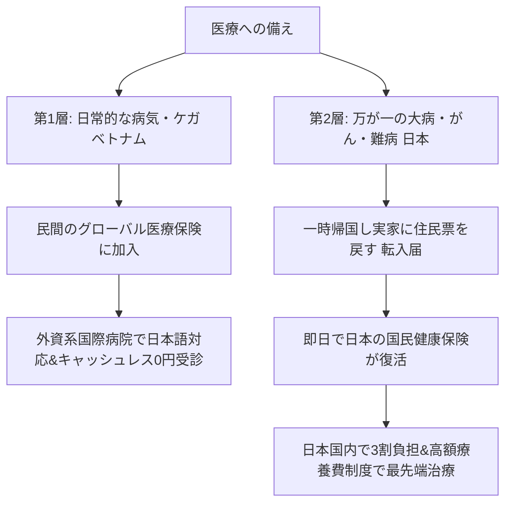
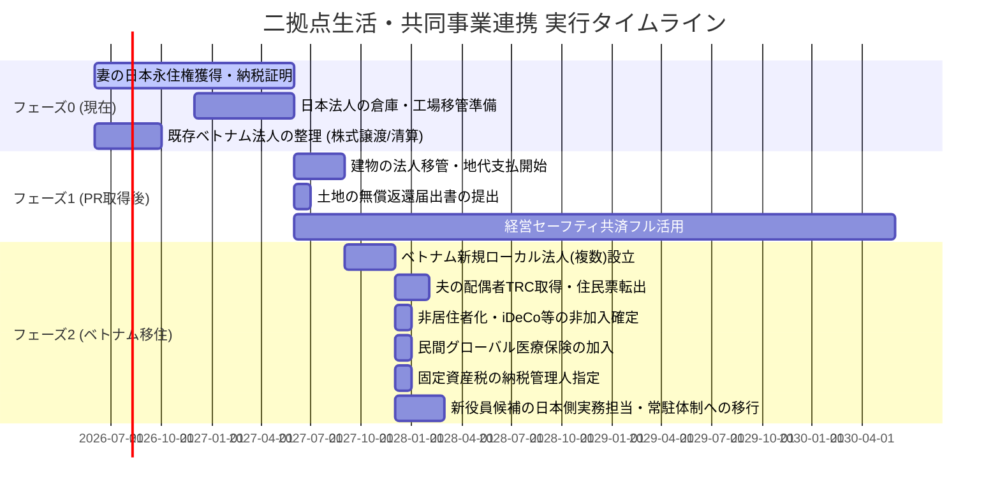

# 資産防衛・日本法人担当一任・日越２拠点共同事業計画 最終実行ロードマップ

本ドキュメントは、これまでのディスカッションを基に、グレーゾーン（税務・ビザリスク）をすべて排除し、生涯のキャッシュフローを最大化するための「完全ホワイト実行ロードマップ」の最終確定版です。

---

## 1. 移住・滞在スキームの全体像（最終確定）

ご夫婦と日本法人を担当する新役員候補のそれぞれの在留ステータスと役割の設計です。

```mermaid
graph TD
    subgraph 経営者夫婦 (日本・ベトナム)
        A[夫: 日本非居住者] --> B[配偶者TRC取得 最長3年更新]
        C[妻: 日本永住権取得優先] --> D[フェーズ0完了後 ベトナム移住]
        B --> E[ベトナム法人から正式に報酬受給/社宅決済]
    end
    subgraph 新役員候補 (日本常駐基本)
        F[新役員候補: 日本居住者] --> G[日本国内で現場実務管理/常駐指揮]
        G --> H[PE恒久的施設リスクの回避実態]
        H --> I[希望時のみ: 将来のベトナム移住オプション]
    end
    subgraph 資本関係 (ガバナンスの維持)
        J[日本・ベトナム法人の資本金] --> K[オーナー夫婦が100%所有]
        K --> L[従業員への出資はさせずガバナンスを完全掌握]
    end
end
```

※ **新役員候補の日本常駐前提について**: 
本計画では、日本法人の実務を担当する新役員候補は日本国内に常駐し、国内現場業務の管理指揮を行います。これにより、オーナー夫婦が日本非居住者となった後も、日本法人の管理支配地が日本国内にあることを税務上明確にし、PE（恒久的施設）認定リスクを極小化します。将来、本人がダナン等への移住・勤務を希望した場合のみ、オプションとしてベトナムでの就労ビザ取得手続き等を実施します（計算上は日本常駐のまま据え置きます）。

---

## 2. ご夫婦の設計：配偶者TRC（一時滞在カード）ルート

奥様がベトナム人であるメリットを最大限に活かし、資金拘束なく最も安定したステータスを構築します。

*   **滞在資格**: **配偶者TRC（最長3年有効・更新可能）**
    *   日本の戸籍謄本等の領事認証のみで取得可能。1,800万円の出資金（資本金）の拘束はありません。
*   **就労と報酬の合法化**:
    *   ベトナム人の配偶者は**「労働許可証（Work Permit）の取得が完全免除」**されます（労働局への3日前の事前通知のみ）。
    *   ベトナム現地法人から役員報酬をクリーンに受け取り、現地の高級コンドミニアム（社宅）の経費決済も100%合法化されます。
*   **60歳までの削減コスト**:
    *   日本の住民票を抜く（非居住者化）ことで、日本の社会保険料（健康保険・厚生年金）が夫婦分ともに完全に0円になります。
    *   これにより、60歳までの24年間で**約4,520万円の税金・社会保険料コストがカット**され、手元キャッシュが最大化します。

---

## 3. 【新論点】ベトナム法人の資本構成と「不動産取得」の戦略

現在、日本人2名で50%ずつ出資しているベトナム法人（外資系企業）がありますが、将来の不動産取得を見据えた場合、ベトナム独自の土地法・住宅法を踏まえた再設計が必要です。

### ① 外資系企業（現在の法人）の不動産取得制限
ベトナムの土地法（最新の Land Law 2024）では、土地は国家所有であり、取得できるのは「土地使用権（LUR）」のみです。
*   **外資系法人の制限**:
    外国人が1%でも出資している法人（外資系法人）は、一般の土地使用権（LUR）の**市場からの直接購入が原則として認められていません**（政府からの直接リースや、工業団地のサブリースのみ可能）。
    *   ※ただし、外資系法人であっても、一定の制限枠内であればコンドミニアム（マンション）の建物所有権を購入することは可能です。

### ② ベトナム人100%出資の「ローカル法人」の圧倒的な優位性
奥様（ベトナム人）が100%出資するローカル企業であれば、外国人規制を受けないため、**ベトナム国内のあらゆる一般土地使用権（LUR）を市場から自由に購入・所有することが可能**になります。

### ③ 既存法人の整理と新規ローカル法人の立ち上げ
*   **既存の外資法人（日本人50%ずつ出資）の整理**:
    ビジネスが停止しており、月約2万円の維持費（監査・会計費用）のみが発生しているため、友人が引き取る場合は「株式譲渡」で籍を抜き、不要な場合は「清算（廃業）」を行って速やかに整理するのが最も合理的です。外資法人特有の高い維持コストを支払う必要はなくなります。
*   **新規ローカル法人（奥様100%）の新設**:
    奥様名義のローカル法人は外部監査が不要ですが、現地の税務・会計の適正維持には日本と同等の相場感（年間約30万円、月約2.5万円程度）を見込みます。

---

## 4. 【新論点】IT企業向け税制優遇と「複数事業展開」時の注意点

一つの法人で「IT事業（優遇対象）」と「それ以外の一般事業（不動産賃貸や別ビジネス：優遇対象外）」を同時に行う場合の税務ルールです。

### ① IT税制優遇は無くならないが、「区分経理（別会計）」が必須
*   **ルール**:
    一つの法人で複数事業を行うことは可能ですが、**「IT事業の売上・経費・利益」と「その他の事業のそれら」を帳簿上、厳密に分けて計算（区分経理）しなければなりません。**
*   **課税の適用**:
    IT事業から発生した利益に対してのみ「4年免税・9年半減（10%）」が適用され、その他の事業から発生した利益に対しては一律で「標準税率20%」が課税されます。

### ② 税務署の「事後監査（税務調査）」におけるリスク
*   オフィスの家賃や役員報酬、人件費などの**「共通経費の按分（分け方）」**について、ベトナムの税務署から「IT優遇を不正に多く見せるための調整ではないか」と厳しく突っ込まれるリスクが跳ね上がります。
*   区分経理が不十分とみなされた場合、IT優遇そのものが取り消されたり、過去に遡ってペナルティ（追徴課税・重加算税）を課されるリスクが生じます。

### ③ 対策：事業ごとの「複数法人設立」が鉄則
*   ベトナム人のローカル法人は、設立コストは安価で外部監査も不要ですが、会計・税務の維持費（税理士顧問料等）は年30万円（1社あたり）程度発生することを想定します。
*   したがって、税務リスクを避けるために以下の通り**法人を完全に切り分けて運用する**のが実務上のセオリーです。
    1.  **ITテスト・開発用法人（奥様名義・IT専業）**: IT以外の事業を一切混ぜず、4年免税・9年半減を100%安全に享受する。
    2.  **不動産・その他事業用法人（奥様名義）**: 不動産の取得やその他のローカルビジネスを通常課税（20%）で行う。

---

## 5. 二拠点生活における「医療・病気」の２層防衛ライン

日本の社会保険を脱退（非居住者化）ことの最大の懸念である「病気になったときの医療コスト」に対する、**完璧な２層の防衛システム**の設計です。



### 【第1層（ベトナム現地）】民間のグローバル医療保険（日常の病気・ケガ）
ベトナムのローカル病院は過密で日本語も通じませんが、外資系の「インターナショナル病院・クリニック」（Family Medical Practice, Raffles Medical, Vinmec 等）は、日本語通訳や日本人医師が常駐し、ホテルのように清潔です。
*   **対策**:
    民間の**「グローバル医療保険（キャッシュレス対応）」**に加入します。
    *   **費用**: 夫（日本国籍）の1人分のみグローバル医療保険（年間約20万円）に加入します。奥様と息子さんはベトナム国籍があるため、現地の公的・ローカル保険で対応します（※ベトナム法人の福利厚生費として経費化可能）。
    *   **効果**: 保険カードを提示するだけで、ベトナムの高級国際病院の窓口支払いが**完全0円（キャッシュレス）**になります。日本の社会保険（年 149 万）を払うより、年間 100 万円以上浮きます。

### 【第2層（日本帰国）】国民健康保険の即日復活（万が一の大病・手術・先進医療）
もしベトナムの医療水準では不安な難病や、長期のがん治療、心臓外科手術などが必要になった場合の最終防衛ラインです。
*   **対策**:
    日本に一時帰国し、実家などに住民票を戻す（転入手続き）を行うことで、**即日で日本の「国民健康保険」に加入可能**です。
    *   **効果**: 日本の保険証が手に入るため、日本滞在時と全く同じ**「3割負担」**および「高額療養費制度（月々数万〜十数万円の上限規制）」を利用して、世界最高水準の日本の医療を極めて安価に受けることができます。治療後は再度、海外転出届を出せば完了です。

---

## 6. 非居住者の地代収入（土地賃貸）の税務ハンドリング

フェーズ1で「建物を法人へ移管、土地は個人に残し地代を法人から支払う」設計にした場合、非居住者となった夫が受け取る地代には以下の税務ルールが適用されます。これを活用して、日本の個人口座に保険料等の維持資金をプールします。

### ① 地代に対する「20.42%の源泉徴収」と「確定申告」
*   **源泉徴収の義務**:
    日本法人が非居住者である夫へ地代を支払う際、法人は地代の**20.42%を源泉徴収**して税務署に納付する必要があります。
*   **確定申告（総合課税）**:
    夫は日本国内に**「納税管理人（親族など）」**を立て、毎年日本で不動産所得の確定申告を行います。地代収入から土地の固定資産税（必要経費）を差し引いた後の不動産所得が小さければ、税率は極めて低く抑えられ、**源泉徴収された20.42%の大部分は還付（日本の個人口座に戻る）されます。**

### ② 借地権の認定課税対策 (重要)
*   親族・同族会社間で土地を貸し借りし、建物を建てる（所有する）場合、借地権の贈与があったとみなされる税務リスク（認定課税）があります。
*   **対策**:
    建物移管時に、日本法人と個人の共同名義で**「土地の無償返還に関する届出書」**を速やかに所轄の税務署へ提出し、不要なみなし贈与課税を回避します。

---

## 7. iDeCo（確定拠出年金）および小規模企業共済への非加入の判断

移住・非居住者化を控えた現在において、日本の税制優遇制度の新規開始に対する合理的な判断です。

*   **結論：今後も新規加入（開始）は行わない（未加入状態の維持）**
*   **理由**：
    iDeCoおよび小規模企業共済は現在未加入（スタート前）です。日本の非居住者（ベトナム居住者）になると、日本国内での課税所得が最小限（地代収入のみ）となり、所得税・住民税が極めて低くなるため、これらの制度の最大のメリットである**「掛金全額の所得控除による節税効果」がほぼ機能しません。**
*   **代替アクション**：
    非居住者化後の煩雑な管理手続きや、将来の資産のロック（60歳まで引き出し不可）などのデメリットを考慮し、日本での新規積立は行わず、浮いた資金はすべてベトナム側での個人証券投資信託（月20万円 / 年利5.0%運用）に回すことで、資産の流動性と利回りを最大化します。

---

## 8. 実行タイムライン（フェーズ別タスク）



> [!NOTE]
> **※ 新役員候補が将来的にベトナム移住・現地勤務を希望した場合の手続きとシミュレーション**
> 新役員候補が将来的にベトナム（ダナン）での勤務および現地移住を希望した場合は、希望された時点で以下の手続きを行い、在留・就労スキームを再設計します。
> 
> **■ 実施手続き・ビザ要件**
> 1. **雇用契約の締結**: ベトナム法人と新役員候補との間で、正式な雇用契約を現地基準（職種: Manager等）で締結します。
> 2. **外国人労働許可証（Work Permit）の取得**: 3年以上の専門職の職歴証明書、大学の卒業証明書に対し、日本国内での公証・領事認証を完了させて申請します。
> 3. **労働TRC（一時滞在カード）の取得**: 労働許可証の発行後、最長2年有効な就労用TRCを申請・取得します。
> 4. **代替PE対策の策定**: 新役員候補の日本不在に伴い、日本法人の契約行為決定プロセス等をどう国内に維持するかを再設計します。
> 
> **■ 移住希望時のシミュレーション（年額）**
> *   **ベトナム社会保険料発生の理由**: オーナー夫婦（夫）は配偶者TRCのため加入不要ですが、新役員候補は「100%支配ガバナンス維持（出資させない）」を最優先にして雇用契約＋労働許可証（WP）で就労させるため、ベトナム社会保険法の規定により加入義務が発生します（支配権維持のための必要安全コストです）。
> *   **【会社側負担（ベトナム現地法人コスト）】**:
>     *   基本給与：年254.3万円（月額21.2万円 / 約4,240万VND）
>     *   公的社会保険料（会社負担分：21.5%）：年約54.7万円（月額約4.56万円 / 約912万VND）
>     *   就労ビザ・労働許可証（WP）申請＆維持費：年約15万円
>     *   *基本コスト合計（日本側と同額）：年309万円（月額25.75万円）*
>     *   *💡 【後日追加予定】会社負担での経費活用枠（日本と同等）*：
>         *   *コンドミニアム（社宅家賃）活用枠：— 円（後々設定）*
>         *   *社用車維持費・関連経費（現地）：— 円（後々設定）*
>         *   *ベトナム・日本往復航空券代・出張旅費：— 円（後々設定）*
>         *   *その他 福利厚生・一般経費：— 円（後々設定）*
> *   **【本人受給分（手取り・自己負担内訳）】**:
>     *   額面給与（基本給）：年254.3万円（月額21.2万円 / 約4,240万VND）
>     *   公的社会保険料（個人負担分：10.5%）：年約26.7万円（月額約2.22万円 / 約445万VND）
>     *   個人所得税（PIT・概算）：年約26.9万円（月額約2.24万円 / 約448万VND）
>     *   福利厚生：コンドミニアム（社宅）を提供（利益状況に応じて後々設定）
>     *   *実質手取り額：年約200.7万円（月約16.7万円 / 約3,346万VND）*

